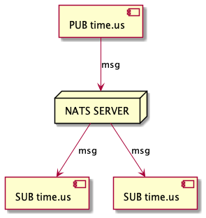
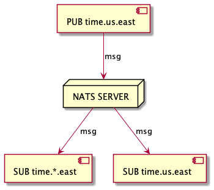
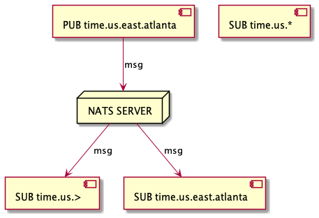
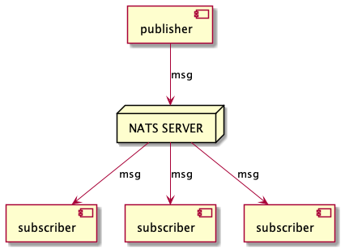
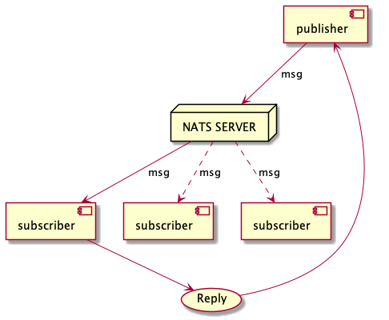
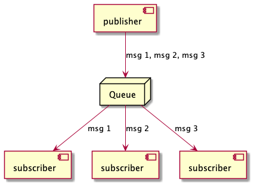

# Pendahuluan
## Koneksi NATS Client Application ke NATS Server

Agar bisa publish/subscribe message subject, kita harus konfigurasi:
- NATS_URL = Format string, yang digunakan untuk membangun koneksi (plain TCP, TLS, or Websocket).
  1. TLS encrypted hanya TCP connection `tls://...`
  2. TLS encrypted jika di konfigurasikan atau konfigurasi plain un-encrypted TCP `nats://...`
  3. Websocket `ws://...`
  4. Koneksi ke cluster `nats://server1:port1,nats://server2:port2`
- Authentikasi (opsional) jika kita butuh aplikasi kita lebih secure. NATS support multi authentikasi (username/password, decentralized JWT, Token, TLS Certificate, NKey Challange)


## NATS Quality of Service (QoS)
Terdapat beberapa QoS di NATS, tergantung dari aplikasi yang kita gunakan apakah Core NATS atau menambahkan fiture JetStream (Jetstream di bangun ke dalam `nats-server` yang mungkin tidak dikonfigurasikan)
- **At most once QoS**: Core NATS menawarkan at most once QoS. Jika subscriber tidak listen ke subject (no subject match), atau tidak aktif ketika message di kirim, message tidak akan diterima. Ini sama dengan level garansi TCP/IP. Core NATS adalah kirim dan lupakan messaging system. **hanya akan di dalam memori dan tidak akan di simpan di disk**
- **At Least / exaclty once QoS**: Jika kamu butuh QoS dengan order tinggi (At Least & exaclty once), atau fungsi yang seperti *persistent streaming, de-coupled flow control, and Key/Value Store* kita bisa gunakan **NATS JetStream** (harus di aktifkan di dalam `NATS server`)

## Setup NATS

Install NATS CLI Tools Di MacOS
```bash
brew tap nats-io/nats-tools
brew install nats-io/nats-tools/nats
```

Install NATS Server secara lokal di MacOS
```bash
brew install nats-server
```

Jalankan NATS Server
```bash
nats-server
# atau jika ingin mengaktifkan fitur monitoring HTTP
nats-server -m 8222
```
Buka di Web browser kita `0.0.0.0:8222` dan NATS Server aktif di port 4222

## NATS CLI
```bash
# Help NATS CLI
nats -h

# Cheat sheet untuk NATS
nats cheat
# Cheat sheet berdasarkan sections
nats cheat --sections
# Contoh
nats cheat pub

nats account info

nast bench test --pub 10

nats  bench test --pub 10 --msgs 1000000
```

## Subject berbasis messaging
Dasarnya, NATS itu mempublish dan listening sebuah message, Keduanya bergantung kepada subject yang ada.

### **Apa itu subject**
 </br>
Sederhananya, subject hanyalah string dari nama character yang mana digunakan *publisher* dan *subscriber* untuk berkomunikasi, Jadi message akan berkomunikasi melalui subject.

**Character yang di izinkan untuk penamaan subject**
- `a to z`, `a to Z` (Case Sensitive, tidak boleh ada spasi)
- Spesial Karakter: `.` digunakan sebagai pemisah dalam subject dan `*`, `>` sebagai wildcards


### **Contoh Subject Hirarki**
```
time.us
time.us.east
time.us.east.atlanta
time.eu.east
time.eu.warsaw
```

## **Wildcards**
- NATS hanya menyediakan 2 buah wildcards
- Wildcard bisa digunakan untuk menggantikan `.` (pemisah subject)
- Subscriber bisa menggunakan wildcard untuk listen ke multiple subject dengan single subscription.
- Publisher tidak bisa menggunakan wildcards

### Single Token (*)
 </br>

Pada contoh diatas subscriber ini akan mendapatkan `msg` `SUB time.*.east` dari subject yang berformat antara `time` dan `east` (hanya satu format token saja)
misal:
```bash
# Di terima karena token (us) single
time.us.east
time.en.east

# Tidak di terima karena token (us.en) multi
time.us.en.east
```

### Multiple Token (>)
 </br>

- Pada contoh diatas `>` hanya bisa di aplikasikan di akhir subject saja, misal `SUB time.us.>`.
- Sebagai contoh `time.us.>` akan cocok dengan `time.us.east` dan `time.us.east.atlanta`, sementara `time.us.*` hanya akan cocok dengan `time.us.east` karena `*` tidak bisa mencocokkan lebih dari satu token.

### Mixing Wildcard
`*` dapat digunakan beberapa kali di subject, sedangkan `>` hanya di akhir saja, misal: `*.*.east.>` akan bisa menerima `time.us.east.atlanta`

### Rekomendasi Subject Token
Di rekomendasikan agar tetap menjaga jumlah token yang masuk akal, maksimal 16 token

# NATS Core

NATS Core adalah `kumpulan fungsi dasar` dan `quality service` yang di offer oleh `NATS service infrastructure`. Dimana tidak ada `nats-server` yang di konfigurasi untuk mengaktifkan `JetStream`.

Fungsi dasar NATS Core adalah `publish/subscribe`, `subject-based-addressing` dan `queuing` dengan QoS **at most once**

## Publish Subscribe
NATS Mengimplementasi distribusi message publish-subscribe dengan model `1:M` one to many communication. Publisher akan mengirim message ke subject dan akan di terima oleh subscriber yang aktif me-listen ke subject tersebut. Pola 1:M biasa disebut `fan-out`

 </br>

### Message
Message terdiri dari
  1. Subject
  2. payload dalam bentuk byte array
  3. number di field headers
  4. opsional `reply` di field address
   
- Message mempunyai ukuran maksimal (yang mana di konfigurasi di `max_payload`).
- Ukuran default nya 1MB, tapi bisa di perbesar sampai dengan 64MB. Rekomendasinya maksimal 8MB

### Latihan
Dalam hal ini akan menggunakan [nats](https://docs.nats.io/nats-concepts/what-is-nats/walkthrough_setup) client untuk berkomunikasi dengan `nats-server`
1. Membuat subscriber dengan format `nats sub <subject>`
   ```bash
   nats sub msg.zul
   ```
2. Membuat publisher dengan format `nats pub <subject> <message>`
   ```bash
   nats pub msg.zul "Hallo Bro"
   ```
3. Membuat subscriber dengan format wildcard single token 
   ```bash
   # Terminal 1
   nats sub "msg.*"
   # Terminal 2
   nats sub "msg.>"

   # Terminal 3
   nats pub msg.zul "Hallo Zul"
   nats pub msg.rif "Hallo Rif"
   nats pub msg.test.yog "Hallo Yog" #Tidak akan di terima oleh msg.* diterima oleh msg.>
   ```

## Request-Reply

Request-Reply adalah pola yang umum di *modern distribution systems*. Sebuah request di kirim, dan aplikasi menunggu response dengan waktu tertentu atau menerima secara asynchronous

- NATS support Request-reply menggunakan mekanisme komunikasi inti - publish dan subscribe. **Responder** akan listen ke subject dan ketika ada **Requester** yang request, maka responder akan langsung meresponse ke reply subject. Reply subject disebut `inbox`.
- Beberapa responder NATS dapat membentuk queue grup yang dynamic. Jadi tidak perlu secara manual add atau remove subscriber dari group untuk memulai dan berhenti mendistribusikan message, karena akan otomatis. Jadi kita bisa men scale up/down sesuai demand.
- Karena NATS pada dasarnya publish-subscribe. Untuk observasi simple kita bisa melihat request dan response untuk mengukur latency.
- Kelebihan NATS bahkan memperbolehkan multiple response.
  


### Latihan
1. Membuat Reply Client Listener (Responder), yang akan menunggu request yang masuk, akan mengirim response ke **Requester**
   ```bash
   nats reply help.please 'OK, I CAN HELP!!!'
   ```
2. Membuat Request Client (Requester), yang akan menerima response dari **Responder**
   ```bash
   nats request help.please 'I need help!'
   ```

## Queue Group

 </br>
Ketika subscriber me-register diri mereka sendiri untuk menerima message. Pola messaging 1:M `fan out` harus memastikan bahwa message yang di kirim oleh publisher, harus tersampaikan ke semua subscriber yang sudah ter-register. Terdapat fitur Queue yang bisa me-register subscriber untuk bagian dari queue disebut `queue groups`.

- Rule penamaan queue disamakan dengan penamaan subject
- Queue subscriber idealnya untuk scalling service

### Publish Subscribe tanpa Queue

1. Membuat publisher publisher
   ```bash
   nats pub --count=-1 --sleep 500ms demo.1 "{{Count}} {{TimeStamp}}"
   ```

2. Membuat 3 buah subscriber
   ```bash
   nats sub demo.1 # terminal 1
   nats sub demo.1 # terminal 2
   nats sub demo.1 # terminal 3
   ```
Pada contoh ini setiap message akan terkirim secara merata di tiap subscriber. 1:M

### Publish Subscribe dengan Queue

1. Membuat publisher publisher
   ```bash
   nats pub --count=-1 --sleep 500ms demo.1 "{{Count}} {{TimeStamp}}"
   ```
2. Membuat 3 buah subscriber
   ```bash
   nats sub demo.1 --queue queue.saya # terminal 1
   nats sub demo.1 --queue queue.saya # terminal 2
   nats sub demo.1 --queue queue.saya # terminal 3
   ```
Pada contoh ini setiap message akan terkirim secara distribusi random, dan akan load balance secara otomatis `Load Balanced Queues`


### Request Reply dengan Qeueu
`nats reply` tidak hanya subscribe, tapi join otomatis ke queue group (`NATS-RPLY-22` by default)

```bash
nats reply menyapa "Ini Zulfikar Reply# {{Count}}" # terminal 1
nats reply menyapa "Ini Arif Reply# {{Count}}" # terminal 2
nats reply menyapa "Ini Noval Reply# {{Count}}" # terminal 3
```

```bash
nats request menyapa --count 10 "Hai aku Doni {{Count}}"
```

### Keuntungan

- Memastikan toleransi kesalahan pada aplikasi `Fault Tolerant`
- Pemprosessan beban dapat di scale up atau down
- Tidak perlu tambahan konfigurasi
- Queue group di definisikan oleh aplikasi client bukan oleh konfigurasi server

### Stream sebagai Queue
JetStream stream juga bisa digunakan sebagai queue dengan men setting retention policy di `WorkQueuePolicy` dan memanfaatkan **pull consumers** untuk memudahkan mendapat horizontal scalability

### Queue Geo Affinity
Ketika kita memiliki NATS Super Cluster yang terhubung secara global, terdapat `automatic service geo-affinity` yang bisa meneruskan request message ke cluster region lain, jika cluster region target tidak tersedia


# JetStream
NATS memiliki `distributed persistence system` yang di panggil JetStream, yang memiliki fitur baru dan memiliki **QoS** yang berorder tinggi diatas Core NATS.

JetStream terintegrasi di `nats-server` dan hanya butuh 1 *(2 atau 5 jika ingin memiliki fault tolerance terhadap 1 atau 2 kegagalan server secara bersamaan)* NATS Server agar JetStream diaktifkan untuk semua aplikasi client yang kita miliki.

JetStream dibuat untuk menyelesaikan masalah yang di identifikasi dengan streaming technology saat ini, yakni kompleksitas *complexity*, kelemahan *fragility*, kuranf nya skalabilitas *lack scalability*.

```bash

# Jalankang server JetStream
nats-server -js -m 8222

# Check JetStream 
nats account info

# Membuat Stream
nats stream add stream_saya

#Info
nats stream info stream_saya

# Publish message ke stream
nats pub test --count=1000 --sleep 1s "publication #{{Count}} @ {{TimeStamp}}"

# Watch consumer
nats consumer next stream_saya pull_consumer --count 1000
```

### Tujuan JetStream di kembangkan
- System harus mudah di konfigurasi, dan di operasikan dan di amati.
- System harus aman dan beroperasi dengan baik dengan NATS 2.0 security model.
- System harus di scale horizontal dan berlaku untuk tingkat konsumsi yang tinggi.
- System harus support multi use case.
- System harus self heal dan selalu available.
- System harus mempunyai API yang dekat dengan Code NATS.
- System harus mengizinkan message NATS menjadi bagian stream yang dinginkan.
- System harus manampilkan perilaku diagnostik payload.
- System harus tidak mempunyai 3rd party aplikasi

## Fungsi yang diaktifkan oleh JetStream

### Temporal decoupling antara publisher dan subscriber
Salah satu prinsip dasar publish/subscribe dibutuhkan coupling sementara antara publisher dan subscriber:
- Subscriber hanya menerima message yang di publish ketika subscriber ini terhubung dengan `Messaging System` yaitu subscriber ini tidak akan menerima message yang di publish jika subscriber ini tidak aktif atau terputus dari messaging system.
- Cara Tradisionalnya untuk `Messaging System` akan menyediakan temporal decoupling dari publisher dan subscriber melalui `durable subscriber` atau melalui Queue, namun tidak ada yang sempurna cara ini.
   1. Durable Subscriber perlu di buat sebelum message di buat.
   2. Queue maksudnya adalah distribusi beban kerja dan konsumsi, untuk tidak digunakan di mekanisme `request - reply`

Bagaimanapun temporal decoupling ini sudah mainstream.
Stream menangkap dan menyimpan message yang di publish pada 1 atau lebih subject dan mengizinkan client membuat subscriber (JetStream Consumer) yang bisa kapan saja di consume semuanya atau hanya beberapa message saja yang di simpan di Stream.

### Reply policies
JetStream support beberapa replay policies, tergantung pada aplikasi consumer yang akan menerimanya:
- Semua message saat ini di simpan di stream, maksudnya reply yang sudah complete. Kita dapat memilih `reply policy` yaitu (kecepatan replaynya) menjadi:
  1.  **Instant**, maksudnya message akan di kirim ke consumer secepat yang dia bisa ambil.
  2.  **Original**, maksudnya message akan di kirim ke consumer pada rate mereka mempublishnya ke stream, sangat berguna untuk contoh staging production server
- Message yang terakhir yang di simpan di stream, atau message yang terakhir untuk tiap - tiap subject (stream dapat mengambil lebih dari 1 subject)
- Di mulai dari spesifik sequence number
- Di mulai dari spesifik waktu start
### Retention Policies dan Limits
Stream tidak akan selalu terus berkembang selamanya (bertambah banyak) dan jetstream support multiple retention policy yang mana kemampuan untuk menentukan ukuran limit pada stream.
#### Limits
Kita bisa limit beberapa pada stream:
- Max umur message
- Max total stream (bytes)
- Max jumlah message di stream
- Max individual ukuran message
- Discard Policy: Ketika limit tercapai, message baru di publish ke stream, kamu dapat memilih untuk membuang message yang terbaru atau sudah lama untuk memberi ruang untuk message yang baru.
   1. Discard Old stream akan otomatis membuang message yang terbaru atau sudah lama untuk memberi ruang untuk message yang baru.
   2. Discard New message yang masuk akan di tolak, dan JetStream akan mempublish return error yang menandakan limit telah tercapai

- limit jumlah consumer yang dapat di define untuk stream pada titik waktu tertentu
#### Retention Policies (Kebijakan Penyimpanan)
- limits (default)
- interest (message akan di simpan di stream selama ada consumer yang menerima message)
- work queue (stream digunakan sebagai shared queue dan message akan di hapus setelah ada yang mengambil nya)
### Persistent Distributed Storage
Kita bisa memilih durability juga ketahanan penyimpanan pesan sesuai kebutuhan.
- Penyimpan Memori
- Penyimpanan File
- Replication (1 (none), 2, 3) antara nats server untuk fault tolerant 
### Stream Replication Factor
Stream Replication Factor (R, sering mengacu pada jumlah `Replicas`) yang menentukan berapa banyak  tempat itu di simpan, yang memungkinkan agar menyesuaikan resiko terhadap penggunaan daya dan kinerja. Stream mudah di bangun kembali atau mungkin sementara base memori R=1 dan stream dapat mentoleransi beberapa downtime yang ada di base R=1

- Replicas=1 tidak bisa beroperasi selama pemadaman server yang sedang melayani stream, Performace tinggi
- Replicas=2 tidak ada keuntungan yang signifikan, di rekomendasikan replicas 3
- Replicas=3 Dapat mentoleransi jika ada 1 server yang mati. Ideal balance antara resiko dan performance
- Replicas=4 tidak ada keuntungan yang signifikan di bandingkan R=3
- Replicas=5 Dapat mentoleransi 2 server yang melayani stream yang mati secara bersamaan. Mengurangi resiko dan mengorbankan performance
### Mirroring Beetwen Streams
Jetstream juga bisa memudahkan administrator me-mirrorkan stream. Sebagai contoh domain jetstream yang berbeda untuk dijadikan `disaster recovery`. Kita juga bisa definisikan salah satu stream sebagai submber untuk lainnya.
### De-coupled flow control
JetStream menyediakan de-coupled flow pada stream, flow control bukanlah `end to end` dimana publisher terbatas untuk publish tidak cepat dari semua consumers yang paling lambat dapat menerima, tapi terjadi secara individual antara aplikasi client (publishers atau consumers) dan nats-server.

Ketika menggunakan JetStream, `Jetstream publish call` untuk mempublish ke stream yang terdapat mekanisme acknowledgement anatara publisher dan nats-server, kita yang menentukan apakah async atau sync (batch) Jetstream publish call.

Pada sisi subscriber mengirim message dari nats server ke client aplikasi atau consume message dari stream juga di kontrol alirannya.
### Exactly once message delivery
Karena publish ke stream menggunakan `JetStream publish calls` di acknowledge oleh server, QoS yang akan di jamin oleh stream `at least once`, artinya meski dapat di andalkan dan bebas dari duplikasi
- ada beberapa skenario kegagalan tertentu, yang dapat membuat aplikasi publisher (salah) mengira bahwa message tidak berhasil di publish maka di publish lagi, 
- ada skenario kegagalan yang dapat menghasilkan aplikasi client meng *consume* acknowledgement yang hilang, dan karena itu message di kirim ulang oleh server ke consumer.
  
Skenario kegagalan tersebut meskipun jarang terjadi tetapi memang ada dan dapat mengakibatkan `duplicate message` pada level aplikasi
### Consumers
JetStream consumer adalah tampilan pada stream, mereka ini mensubscribe atau di pull oleh aplikasi client untuk memperoleh copy an (atau consume jika stream di set sebagai `work queue`) message yang di simpan di stream.
#### Fast push consumers
Aplikasi Client dapat memilih untuk menggunakan fast un-acknowledged `push` (ordered) consumers untuk menerima message secepat mungkin
### Horizontally scalable pull consumers with batching
Aplikasi client juga bisa menggunakan dan share pull consumer berdasarkan demand, support batch. Pull Consumers bisa dan dimaksudkan antar aplikasi (seperti group queue) dalam memberikan kemudahan dan transparansi horizontal scale pada pemprosessan dan konsumsi message dalam stream tanpa mempunyai sebagai contoh khawatir karena harus mendefinisikan partisi, atau khawatir tentang fault tolerant.
Catatan: Menggunakan pull consumer bukan berarti kamu tidak akan mendapatkan update dari pesan baru yang di publish ke stream `pushed` secara realtime di aplikasi kamu, karena kamu dapat memberikan timeout ke consumer fetch call dan loop.

### Consumer acknowledgements
- Beberapa consumer support acknowledged semua message sampai dengan jumlah sequence yang di terima, beberapa consumer menyediakan QoS yang tinggi tetapi membutuhkan acknowledge penerimaan dan pemprosesan setiap pesan secara explisit serta jumlah waktu maksimal server akan menunggu acknowledgement untuk spesifik message sebelum di kirim (ke proses lain yang di lampirkan ke consumer).
- Bisa mengirim balik negative acknowledgements
- Bahkan bisa mengirim progress acknowledgements
### Key Value Store
JetStream merupakan persistance layer, dan streaming hanya salah satu dari fungsional yang di bangun di atas layer itu.

Fungsi lainnya (umumnya tidak ada dalam messaging system) adalah **JetStream Key Value Store**: kemampuan untuk menyimpan, mengambil, delete value message yang terasosiasi dengan key, untuk watch (listen) perubahan yang terjadi pada key tersebut, dan bahkan untuk mengambil history (nilai yang ada dan yang di hapus) pada key tertentu
### Object Store
Object Store sama dengan key value store, tetapi di design dengan penyimpanan yang lebih besar `objects` (contoh file, atau yang bisa lebih besar lagi) by default 1 MB

## Stream
Stream adalah `message stores`, tiap stream mendefinisikan bagaimana message di simpan seperti limit (durasi, size, interest) atau retention rate. Stream consume normal NATS Subject, tiap message yang di publish ke subject tersebut akan di simpan di sistem storage, Kita bisa kirim message dengan unknowledge delivery, meskipun menggunakan `Jetstream publish call` lebih bagus karna Jetstream server akan reply dengan acknowled (mengirim balik), untuk memastikan bahwa message berhasil di simpan.

.png?alt=media)

- Gambar di atas bagaimana stream menyimpan semua message dari `ORDERS.*`
- Streams dapat consume banyak subject. Di sini ada `ORDERS.*`, bahkan kita juga bisa consume dengan subject `SHIPPING.*`, tetapi di gambar tersebut hanya menunjukan contoh order.
- Stream support berbagai retention policies, berikut list nya

|Item | Description|
|-----|------------|
|Name | Penamaan Stream tidak menggunakan spasi, tabs, period`.`, lebih besar`>`, asterisk`*`
|Storage | Tipe penyimpanan, `File` atau `Memori` |
|Subjects | List subjects untuk di consume |
|Replicas | Berapa banyak replicas untuk menyimpan setiap message di cluster JetStream, max 5 |
|MaxAge | Max umur message di stream (ns) |
|MaxBytes | Berapa banyak bytes yang mungkin disimpan di stream, jika sudah melebihi size akan menghapus message lama atau me-reject message baru |
|MaxMsgs | Berapa banyak jumlah message yang mungkin di simpan di stream, jika sudah melebihi jumlah message yang di tentukan  akan menghapus message lama atau me-reject message baru |
|MaxMsgSize | Ukuran terbesar message yang di perbolehkan oleh stream |
|MaxConsumers | Berapa banyak consumer yang dapat di define di stream, default -1 (unlimited) |
|NoAck | menonaktifkan acknowledge, jika message sudah di terima oleh stream (tidak mendapat respon success) |
|Retention | Bagaimana retention di consider `LimitsPolicy`(default), `InterestPolicy`, `WorkQueuePolicy` |
|Discard |Ketika stream mencapai limit `DiscardNew` akan menolak message baru, `DiscardOld` menghapus message lama |
|Duplicates | untuk melacak message yang duplikat dalam (ns) |

## Consumers
Consumers dapat dipahami sebagai `views` di stream, Consumers mengkonsumsi message dari semua atau subset message yang di simpan di stream, sesuai dengan `subject filter` dan `replay policy` dan dapat digunakan oleh 1 aplikasi atau lebih. tidak apa-apa untuk membuat banyak consumers menunjuk pada stream yang sama.

Consumers bisa `push` atau `pull`. Dimana `push` JetStream akan mengirim message secepat mungkin (sambil mematuhi `rate limit policy`) untuk subject yang kita pilih. Sedangkan `pull` mempunyai kontrol untuk menanyakan server untuk message. Pilihan ini tergantung use case tetapi typical nya aplikasi client butuh mendapatkan replay message dari stream kita gunakan `push`. Sedangkan use case scalling horizontal pemprosessan message dari stream gunakan `pull`.

Berikut configurasi consumer

| Item | Description |
|------| ----------- |
| AckPolicy | Bagaimana message harus di acknowledge, Jika ack wajib lalu tidak menerima message, (dengan konfigurasi `AckWait`) message akan dikirim ulang. </br> - **`AckExplicit`** (default) tiap individual message harus di acknowledge. </br> - **`AckNone`** tidak perlu men ack message apapun, server akan mengasumsi bahwa ack saat delivery. </br> - **`AckAll`** Jika kita menerima serangkaian message maka hanya perlu menandai message yang terakhir di terima saja. Otomatis message sebelumnya statusnya menjadi ack.
| AckWait | Menunggu ack dalam (ns) bahwa server akan menunggu ack di tiap - tiap individual message setelah dikirim ke consumers. Jika ack tidak di terima, maka message akan dikirim ulang.
| DeliveryPolicy/</br>OptStartSec/</br>OptStartTimer | Ketika consumer pertama kali dibuat, kita bisa menentukan spesifikasi di stream dimana kita ingin memulai menerima messages dengan `DeliveryPolicy`. </br> - **`DeliverAll`**(Default) Consumer akan menerima message dari awal message diterima. </br> - **`DeliverLast`** Ketika pertama kali consume message. Consumer akan memulai menerima message dengan message yang terakhir di terima stream. </br> - **`DeliverLastSubject`** Ketika pertama kali consume message, dimulai dengan yang terbaru untuk setiap subject yang di filter saat ini. </br> - **`DeliverNew`** Ketika pertama kali consume message, consumer hanya akan memulai menerima message yang sudah dibuat setelah consumer dibuat. .</br> - **`DeliverByStartSequence`** Ketika pertama kali menerima message, dimulai dari set message tertentu, consumer harus menentukan `OptStartSeq`, urutan sequence tertentu untuk consumer mulai consume. </br> - **`DeliverByStartTime`** Ketika pertama kali consume message, message mulai diterima pada atau setelah waktu ini. |
| DeliverySubject | Subject untuk men-observasi message yang dikirim. Dengan ini membuat `push consumer` dan `pull consumer` tidak perlu delivery subject yang static. Jika kita ingin mendistribusi message antara subscriber ke consumer maka kita perlu men spesifikasi nama qeueu group. |
| Durable (Nama) | Nama dari consumer, server yang mana yang akan melacak, mengizinkan melanjutkan consume di tempat yang ditinggalkan. Secara default consumer bersifat sementara, untuk membuat tahan lama (durable), maka set nama nya. |
| FilterSubject | Ketika consume dari subject wildcard, kita dapat memilih himpunan bagian saja dari full wildcard untuk menerima message. |
| MaxAckPending | Mengimplementasikan bentuk sederhana 1:M flow control. Men set jumlah max message tanpa acknowledgement, ketika limit tercapai delivey message akan di suspend. Kita tidak bisa menggunakan `AckNonePolicy`. -1 = unlimited. |
| MaxDeliver | Maximum frekuensi message yang akan diterima, berulaku untuk ack. |
| RateLimit | Digunakan untuk membatasi pengiriman message ke consumer. Dalam bit/s. |
| ReplayPolicy | Ini hanya akan di aplikasikan jika `DeliverAll`, `DeliverByStartSequence` or `DeliverByStartTime`. Karena membaca message bukan dari akhir Jika `ReplayOriginal` message dalam stream akan di push ke client pada rate yang sama. Jika `ReplayInstant` (default), message akan dikirim secepat mungkin, ketika mematuhi `AckPolicy`, `MaxAckPending`, dan cliet yang mempunyai kemampuan consume message itu. |
| SampleFrequency | Set persentasi acknowledgement yang harus di ambil samplenya untuk observasi, dari 0 - 100 dalam string, contoh nilai yang valid `30` dan `30%`.

## Latihan
.png?alt=media)

- Banyak relasi subject yang disimpan di stream.
- Consumer bisa memiliki mode operasi yang berbeda, dan hanya menerima beberapa bagian message.
- Beberapa Acknowledgement mode support.

1. Order masuk di `ORDERS.received` di kirim ke Consumer `NEW` yang jika berhasil akan membuat message baru di `ORDERS.processed`.
2. Ketika message masuk di `ORDERS.processed` maka Consumer `DISPATCH` akan menerimanya dan setelah selesai di proses akan membuat `ORDERS.completed` yang akan di simpan di stream.
3. Operasi - operasi ini adalah `pull` yang artinya mereka adalah `work queue` dan dapat di scale horizontal. Semuanya butuh acknowledgement untuk memastikan tidak ada orders yang hilang atau missing.
4. Semua message akan di deliver ke Consumer `MONITOR` tanpa ada acknowledgement menggunakan Pub/Sub semantik, mereka di push ke monitor.
5. Saat message di acknowledgement di `NEW` dan `DISPATCH` Consumer. Percentage mereka adalah sample dan message yang menunjukan jumlah pegiriman ulang, ack delay, dll. Di kirim ke sistem monitoring.

```bash
# Check help Stream
nats stream --help

# Membuat Stream
nats stream add ORDERS --subjects "ORDERS.*" --ack --max-msgs=-1 --max-bytes=-1 --max-age=-1 --storage file --retention limits --max-msg-size=-1 --discard=old

# Print list semua Stream
nats stream ls

# Print info Stream ORDERS
nats stream info ORDERS

# kosongkan message yang ada di stream
nats stream purge

# hapus stream
nats stream rm
```

Membuat Consumer
```bash
# Check help consumer
nats consumer --help

# Membuat Consumer NEW
nats consumer add ORDERS NEW --filter ORDERS.received --ack explicit --pull --deliver all --max-deliver=-1 --sample 100

nats consumer add ORDERS DISPATCH --filter ORDERS.processed --ack explicit --pull --deliver all --max-deliver=-1 --sample 100

nats consumer add ORDERS MONITOR --filter '' --ack none --target monitor.ORDERS --deliver last --replay instant

# Print semua consumer
nats consumer ls
nats consumer ls -a ORDERS

#Print info consumer
nats consumer info -a ORDERS NEW
```

## Key/Value Store

Jetstream mempunyai fitur penyimpanan key/value, yang mana client dapat membuat bucket.
Kita bisa gunakan beberapa KV bucket dalam beberapa operasi

- put: Mengaitkan nilai dengan key
- get: Mengambil nilai dari key
- delete: hapus nilai yang terkait dengan key
- purge: hapus semua nilai yang terkait dengan semua key
- create: Mengaitkan nilai dengan key jika mendefine nilai
- update: compare & set (membandingkan dan menukar) nilai pada key
- keys: ambil copy semua kunci (dengan nilai dan yang terkait)

Kita bisa set limit pada bucket
- Max ukuran bucket
- Max ukuran tiap satu nilai
- TTL: Berapa lama nilai yang akan disimpan
  
Terakhir
- watch: amati perubahan yang terjadi pada key
- watch all: amati semua perubahan yang terjadi pada semua key di bucket
- history: Ambil history dari nilai

### Latihan
```bash
# print list bucket
nats kv ls

# Bikin bucket kv
nats kv add bucket_saya

# Bikin key value pada bucket
nats kv put bucket_saya key1 "hai zul"

# Ambil nilai key dari bucket
nats kv get bucket_saya key1

# Hapus key dari bucket
nats kv del bucket_saya key1

# Amati perubahan pada bucket
nats kv watch bucket_saya
nats kv put bucket_saya Key1 Value2

# Hapus bucket
nats kv rm bucket_saya
```

## Object Store
Object Store hampir sama dengan Key Value, perbedaannya adalah pada ukuran nilai (value) pada key value store hanya 1 MB (default). Sedangkan pada Object Store bisa ukuran apa saja, Object Store mengimplementasi potongan (chunking) mekanisme, bisa mengambil dan menyimpan files

### Latihan
```bash
# Bikin file uji
touch test.txt
echo 'File Percobaan' test.txt
cat test.txt

# Print list object bucket
nats object ls

# Bikin object bucket
nats object add bucket_file

# Simpan file di bucket
nats object put bucket_file ./test.txt

# Print isi semua dari bucket
nats object ls bucket_file

# Ambil file dari bucket
nats object get bucket_file test.txt

# Hapus file dari bucket
nats object rm bucket_file test.txt

# Print informasi tentang bucket
nats object info bucket_file

# Amati perubahan bucket
nats object watch bucket_file

# Segel bucket
nats object seal bucket file

# Hapus bucket
nats object rm bucket_file
```

# Security NATS
Koneksi dengan encrypted TLS

## Buat TLS dengan [mkcert](https://github.com/FiloSottile/mkcert)
### Install mkcert
```bash
brew install mkcert
```

### Buat TLS Certificate
```bash
mkcert -install
mkcert -cert-file server-cert.pem -key-file server-key.pem localhost ::1
```

## Authentication
### 1. Dengan Token
- Dengan Plaintext Token
   ```bash
   authorization {
       token: "s3cr3t"
   }
   ```
   atau dengan
   ```bash
   nats-server --auth s3cr3t
   ```
   Contoh Cara Koneksi
   ```bash
   nats sub -s nats://s3cr3t@localhost:4222 ">"
   ```
- Deklarasi dengan Bcrypted di NATS tool
   ```bash
   nats server passwd
   ```
   Contoh password yang dimasukan: `inipanjangnyaharuslebihdari22character`
   ```bash
   authorization {
       token: "$2a$11$mDGRKbUX31IqQ1/s1aP.eeEs.3ORkZXT198eqaYi0F7w1NwNjdufe"
   }
   ```
   Contoh Cara Koneksi
   ```bash
   nats sub -s nats://inipanjangnyaharuslebihdari22character@localhost:4222 ">"
   ```
### 2. Dengan Username dan Password
1. Dengan Plaintext password
   ```bash
   authorization: {
       user: a,
       password: b
   }
   ```
   atau dengan
   ```bash
   nats-server --user a --pass b
   ```
   Dengan multiple User
   ```bash
   authorization: {
       users: [
           {user: a, password: b},
           {user: b, password: a}
       ]
   }
   ```
2. Dengan Bycrpted Password
   ```
   nats server passwd
   ```
   Tambahkan di file konfigurasi kita
   ```bash
   authorization: {
       users: [
           {user: a, password: "$2a$11$V1qrpBt8/SLfEBr4NJq4T.2mg8chx8.MTblUiTBOLV3MKDeAy.f7u"},
           ...
       ]
   }
   ```
Contoh Cara Koneksi
```bash
nats sub --user=a --password=b -s nats://localhost:4222 ">"
```

**Catatan: Kita tidak bisa menggunakan metode token dan user/pass bersamaan**

## Authorization
NATS Support Authorization menggunakan subject level permission pada per user. Authorization ini tersedia pada multi level authentication via `users` list.

Setiap permission menentukan user apakah dapat publish atau subscribe. Untuk complex configuration, kita dapat menspesifikasikan permission object yang secara explicit mengizinkan atau melarang subject.

Spesial di dalam authorization map adalah `default_permissions`. Ketika di define maka permission akan diaplikasikan ke seluruh user yang tidak punya authorization.

### Permission Configuration Map
`map` permission menspesifikasikan subject yang dapat di subscribe dan di publish ke client tertentu.

|Property | Description|
|---------|------------|
|publish| subject, list subject yang dapat di publish oleh client. |
|subscribe | subject, list subject yang dapat di subscribe oleh client. Dalam context ini memungkinkan memberikan nama queue (opsional): `<subject> <queueu>` untuk mendefinisikan queue group permission. Permission ini juga bisa menggunakan wildcard `.*` dan `.>` |
|allow_responses | true atau false, default false |

#### Contoh dengan Variable
```bash
ADMIN_PASS: "admin123"
CLIENT_PASS: "client123"
SERVICE_PASS: "service123"
OTHER_PASS: "other123"

authorization {
  default_permissions = {
    publish = "DEFAULT_PUB.*"
    subscribe = ["PUBLIC.>", "_INBOX.>"]
  }
  ADMIN = {
    publish = ">"
    subscribe = ">"
  }
  REQUESTOR = {
    publish = ["req.a", "req.b"]
    subscribe = "_INBOX.>"
  }
  RESPONDER = {
    publish = "_INBOX.>"
    subscribe = ["req.a", "req.b"]
  }
  users = [
    {user: admin,   password: $ADMIN_PASS, permissions: $ADMIN}
    {user: client,  password: $CLIENT_PASS, permissions: $REQUESTOR}
    {user: service,  password: $SERVICE_PASS, permissions: $RESPONDER}
    {user: other, password: $OTHER_PASS}
  ]
}
```
Coba publish atau subscribe nya
```bash
# Client harusnya tidak bisa subscribe pada seluruh subject, ada violation
nats sub --user=client --password=client123 -s nats://localhost:4222 ">" 

# Client dapat subscribe ke "_INBOX.>"
nats sub --user=client --password=client123 -s nats://localhost:4222 "_INBOX.>"

# Other tidak bisa subscriber ke ">"
nats sub --user=other --password=other123 -s nats://localhost:4222 ">"

# Other tidak assign ke permissions mana pun yang artinya dia akan di binding ke default_permissions
nats sub --user=other --password=other123 -s nats://localhost:4222 "PUBLIC.>"
```

### Permission Map
Permission map mengizinkan kita secara list explisit untuk allow dan deny, kita bisa deklarasi keduanya sekaligus, jika kita mendefinisikannya secara tumpang tindih maka deny akan lebih di prioritaskan.
|Property | Description |
|---------|-------------|
| allow | list nama subject yang di izinkan untuk client yang diassign |
| deny | list nama subject yang akan di tolak untuk client yang di assign |

### Contoh Permission map
```bash
authorization {
  users = [
    {
      user: admin
      password: admin123
      permissions: {
        publish: ">"
        subscribe: ">"
      }
    }
    { 
      user: other
      password: other123
      permissions: {
        publish: {
            deny: ">"
        }, 
        subscribe: {
            allow: "client.>"
        }
      }
    }
  ]
}
```
Coba publish atau subscribe nya
```bash
# Other tidak bisa sub ke >
nats sub --user=other --password=other123 -s nats://localhost:4222 ">"

# Other bisa subscribe ke client.>
nats sub --user=other --password=other123 -s nats://localhost:4222 "client.>"

# Other tidak akan bisa publish
nats pub test --user=other --password=other123 -s nats://localhost:4222 "haii"
```

#### Allow Response Map
`allow_responses` memungkinkan kita mengkonfigurasi jumlah maksimum response dan berapa lama permission nya valid. Ketika di set true, hanya satu response yang di izinkan (default).

|Property | Description |
|---------|-------------|
| max | Maksimal jumlah response message yang dapat di publish |
| expires | Jumlah waktu permission yang valid, 1s, 1m, 1h. Default nya tidak mempunyai limit time.
### Contoh `allow_responses`

```bash
authorization {
  users: [
    { 
      user: a,
      password: a 
    }
    { 
      user: b,
      password: b,
      permissions: {
        subscribe: "b",
        allow_responses: true
        }
      }
    { 
      user: c,
      password: c,
      permissions: {
        subscribe: "c",
        allow_responses: { 
          max: 5,
          expires: "1m"
        }
      } 
    }
  ]
}
```
Contoh Req/Reply
```bash
# Tidak ada permission
nats reply c --user=b --password=b -s nats://localhost:4222 'respon dari b'

# Terminal 1
nats reply q --user=b --password=b -s nats://localhost:4222 'respon dari b'

# Terminal 2
nats reply q --user=c --password=c -s nats://localhost:4222 'respon dari c'

# Terminal 3
nats request q --user=a --password=a -s nats://localhost:4222 'req dari a'
```

### Queue Permission
```bash
authorization {
   users = [
    {
      user: "a", password: "a", permissions: {
        sub: {
          allow: ["test queue"]
        }
      }
    },
    {
      user: "b", password: "b", permissions: {
        sub: {
          allow: ["test", "test v1", "test v1.>", "test *.dev"]
          deny: ["> *.prod"]
        }
      }
    }
  ]
}
```
Coba publish atau subscribe dan queue nya
```bash
# User a hanya bisa subscribe ke test subject dan "queue" sebagai nama queuenya
nats sub test --queue queue --user=a --password=a -s nats://localhost:4222

# User a tidak bisa subscribe ke subject test2
nats sub test2 --queue queue --user=a --password=a -s nats://localhost:4222
# User a tidak bisa subscribe ke queue queue2
nats sub test --queue queue2 --user=a --password=a -s nats://localhost:4222
# User a tidak bisa subscribe ke subject test tanpa queue
nats sub test --user=a --password=a -s nats://localhost:4222
```

# Reloading a Configuration
Jika kita ingin menghapus / menambah konfigurasi, dan kita ingin mengimplementasi perubahan untuk reload tanpa restart server dan disconnect client maka kita gunakan
```bash
nats-server --signal reload
```
# Aplikasikan Konfigurasi di NATS
```bash
nats-server -c config/server.conf -ms 8222
```
Jalankan `https://localhost:8222`